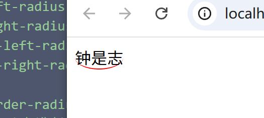

# border-radius
#### border-radius 对4个角进行设置
````
 border-radius: 10px 20px 30px 40px; // 上右下左
````
#### border-top-left-radius // 左上角
#### border-top-right-radius // 右下角
#### border-bottom-left-radius // 左下角
#### border-bottom-right-radius // 右下角

#### 设置为圆形 border-radius: 50%;
#### 可以对文本行级元素进行设置圆角 使其达到一定的特殊效果

```
 span{
     border-bottom: 1px solid red;
     border-radius: 50%;
 }
 <span>钟是志</span>
```


