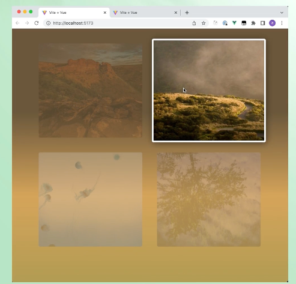

# CSS-跟随图片变化的背景色
- 获取图片的主要颜色用于背景渐变
- [B站](https://www.bilibili.com/video/BV1nqRnY6EDT)
-  需要安装依赖 ```colorthief```获取图片的主要颜色. 并丢给背景
-  注意 ```getPalette```并不是个异步方法
   
```javascript
import styles from './styles.less';
import React, { useState } from 'react';
import Colortheif from 'colorthief';

const colortheif = new Colortheif();
export default function Index() {
  const [activeIndex, setActiveIndex] = useState(-1);
  const [bgColors, setBgColors] = useState(['#fff', '#fff', '#fff']);
  function onMouseEnter(index) {
    setActiveIndex(index);
    if(index >= 0) {
      const imgs = document.querySelectorAll('img');
      if(imgs[index] && imgs[index].src){
        const a = colortheif.getPalette(imgs[index], 3);
        if(Array.isArray(a)) {
          setBgColors(a.map((g) => {
            return `rgb(${g[0]},${g[1]},${g[2]})`;
          }));
        }
      }
    } else {
      setBgColors(['#fff', '#fff', '#fff']);
    }
  }
  const data = new Array(4).fill(1);
  return (
    <div className={styles.container}
         style={{ // 设置渐变背景颜色
           background: `linear-gradient(to right, ${bgColors[0]}, ${bgColors[1]}, ${bgColors[2]})`,
         }}
    >
      {data.map((item, index) => {
        return (
          <div className={styles.item}
               onMouseEnter={ () => onMouseEnter(index)}
               onMouseLeave={() => onMouseEnter(-1)}
               key={index}>
            
          </div>
        );
      })}
    </div>
  );
}
```
```css
.container{
  display: grid;
  grid-template-columns: 1fr 1fr;
  grid-template-rows: 1fr 1fr;
  width: fit-content;
  height: fit-content;
  gap: 20px;
  padding: 20px;
}
.item{
  width: 200px;
  height: 300px;

}
.item img{
  width: 100%;
  height: 100%;
  cursor: pointer;
  border: 2px solid #fff;
  border-radius: 10px;
}
```
