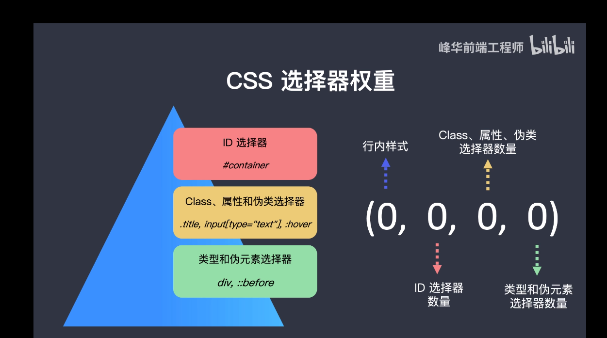

# 选择器的权重 
- 以下权重从上到下递减
- 行内样式 						(1, 0, 0, 0)
- ID选择器数量 					(0, 1, 0, 0)
- Class、属性、伪类、选择器数量、	(0, 0, 1, 0)
- 类型和伪元素选择器数量                     (0, 0, 0, 1)
- 通配符 *的权重为0                                   (0, 0, 0, 0)
- 继承的样式                                           无 NULL

