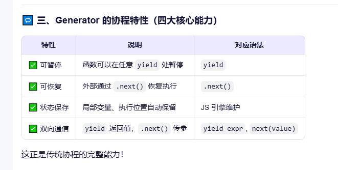

# 生成器Generator
## JavaScript中最接近``协程``的语言特性
- 结论: Generator 是 JavaScript 中最接近“真正协程”的语言特性。
- 它允许函数在执行过程中 主动暂停（yield） 和 外部恢复（next），
- 并且能 双向通信，完全符合协程的核心定义(暂停和恢复)。



## Generator 实现原理（V8 内部机制）
- 普通函数：调用 → 压栈 → 返回 → 出栈（状态丢失）
- Generator：调用 → 创建独立上下文 → 暂停时保留在内存中 → 恢复时继续使用
- 编译器会将 Generator 编译成一个``状态机``
```javascript
// 伪代码：Generator 编译后的状态机
function genStateMachine() {
  let state = 0;
  let x;

  return {
    next(value) {
      switch (state) {
        case 0:
          console.log('A');
          state = 1;
          return { value: 1, done: false };
        case 1:
          console.log('B');
          state = 2;
          return { value: 2, done: false };
        case 2:
          x = value;
          console.log('C', x);
          state = 3;
          return { value: x + 1, done: true };
      }
    }
  };
}
```


## 定义

1.  生成器(Generator)函数是 ES6 提供的一种异步编程解决方案,语法行为与传统函数完全不同.
2.  一种特殊的函数
3.  纯回调函数
4.  yield 表示 函数代码的分隔符;
5.  生成器就可以实现函数暂停和恢复
6.  实现该逻辑的核心是协程
7.  ``function *``

## 示例
```javascript
  function * gen(){
        console.log('hello generator');
    }
    let iter = gen();
    iter.next(); // hello generator

    function *gen(){
            console.log(1);
            yield '一只没有耳朵';
            console.log(2);
            yield '一只没有尾巴';
            console.log(3);
    }
        let iter = gen();
        iter.next(); // 1
        iter.next(); // 2
        iter.next(); // 3
        iter.next(); // 不打印任何东西


     function *gen(){
            yield '一只没有耳朵';
            yield '一只没有尾巴';
        }
        let iter = gen();
        console.log(iter.next()); // {value: "一只没有耳朵", done: false}
        console.log(iter.next()); // {value: "一只没有尾巴", done: false}
        console.log(iter.next()); // {value: undefined, done: true}
        let iter2 = gen();
        for(let item of iter2){
            console.log(item);
            // 一只没有耳朵
            // 一只没有尾巴
        }

```
## 实战
#### 使用生成器 比较字符串 - 2025年9月1日
- [B站](https://www.bilibili.com/video/BV1tXh7zfESx)
- 生成器可以遍历字符串.并抛出截取的值.
```javascript
function *walk(str) {
    let n = '';
    for(let i = 0; i < str.length; i++) {
        const char = str[i];
        if(char === '-') {
            if(n) {
                yield Number(n)
            }
        } else {
            n += char;
        }
    }
    if(n) {
        yield Number(n);
    }
}
```
  
## 应用

### next传参

1.  next方法可以传入实参.
2.  传入的实参会成为 下一个 yield 语句==整体的返回结果==

```javascript

    function * gen(arg){
           console.log(arg);
           // 暂停1
           
           let one = yield 1;
           console.log(one);
            // 暂停2
            
           let two =  yield 2;
           console.log(two);
            // 暂停3
            
           let three = yield 3;
           console.log(three);
           // 暂停4
       }
       let iter = gen('AAA'); //不会打印任何东西
       iter.next(); // AAA 暂停1
       iter.next('BBB'); // BBB 暂停2
       iter.next('CCC'); // CCC 暂停3
       iter.next('DDD'); // DDD 暂停4
```

### 异步编程

1.  解决异步回调地狱

```javascript


    // 声明生成器函数
        function * gen(){
            yield one();
            yield two();
            yield three();
        }
        let iter = gen();

        // 创建3个异步任务
        function one(){
            setTimeout(()=>{ 
                console.log(111);
                iter.next();
            }, 1000);
        }
        function two(){
            setTimeout(()=>{
                console.log(222);
                iter.next();
            }, 2000);
        }
        function three(){
            setTimeout(()=>{
                console.log(333);
                iter.next();
            }, 3000);
        }

        // 调用生成器函数的迭代器
        iter.next();
```

1.  实现类似 async await 转化 异步为同步的写法

```javascript


        function getUsers(){ //异步任务 函数1
            setTimeout(() => {
                let data = '用户数据';
                // 调用 next 方法, 并且将数据传入
                iter.next(data);
                //第二次调用next 方法 它的实参将作为生成器函数中第一个yield的返回结果.
            }, 1000);
        }
        function getOrders(){ //异步任务 函数2 可以直接传入函数1返回的结果
            setTimeout(() => {
                let data = '订单数据';
                iter.next(data);
                //第三次调用next 方法 它的实参将作为生成器函数中第二个yield的返回结果.
            }, 1000);
        }
        function getGoods(){ //异步任务 函数3
            setTimeout(() => {
                let data = '商品数据';
                iter.next(data);
                //第四次调用next 方法 它的实参将作为生成器函数中第三个yield的返回结果.
            }, 1000);
        }

        //声明生成器函数
        function * gen(){
           const usersInfo =  yield getUsers();
           console.log(usersInfo); // 用户数据
           const ordersInfo =   yield getOrders();
           console.log(ordersInfo); // 订单数据
           const goodsInfo =   yield getGoods();
           console.log(goodsInfo); // 商品数据
        }

        //调用生成器函数
        const iter = gen();
        iter.next();
```

#### 修饰器 @  本质上是函数

1.  ES7修饰器 @
    Decorator是一个函数，用来修改类或者类的属性的行为。
    说的直白点修饰器就是给类添加或者修改类的变量与方法的。
    先看一个例子

```javascript

    @addCxh
    class DaBao {}
    function addCxh(target){
        target.cxh = "first"
    }
    console.log(DaBao.cxh); // first
    // DaBao增加了属性 cxh 且值为 first

```
