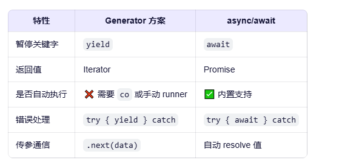
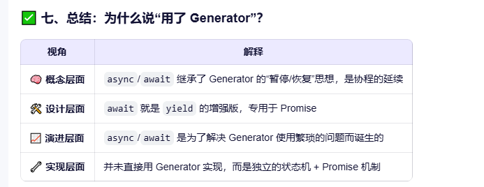

# async await

## 实现原理
- async/await 的设计思想和行为 是一个 基于 Promise 的``用户态协程``。
- 它允许函数在执行过程中暂停和恢复，但它并不是传统意义上的“操作系统级协程”，
- 而是基于 JavaScript 的``事件循环`` + ``Promise`` + ``状态机`` 实现的 用户态协作式并发机制。

```javascript
async function foo() {
  const a = await p1;
  const b = await p2;
  return a + b;
}
```
等价于
```javascript
function foo() {
  let state = 0;
  let a, b;

  return new Promise((resolve, reject) => {
    function step() {
      switch (state) {
        case 0:
          state = 1;
          p1.then(value => {
            a = value;
            step(); // 恢复
          }).catch(reject);
          return;
        case 1:
          state = 2;
          p2.then(value => {
            b = value;
            resolve(a + b); // 完成
          }).catch(reject);
          return;
      }
    }
    step();
  });
}
```

```javascript
async function asy1() {
    console.log(1);
    await asy2();
    console.log(2);
}

const asy2 = async () => {
    await setTimeout(() => {
        Promise.resolve().then(() => {
            console.log(3);
        });
    }, 0);
};

const asy3 = async () => {
    Promise.resolve().then(() => {
        console.log(6);
    });
}
asy1();
console.log(7);
asy3();
// 1 7 6 2 3 

```
### 总结:
####  1. async 函数中 第一个 await 前的所有代码都是同步代码.
####  2. await后如果不是一个Promise 浏览器会自动给他转成 Promise.resolve(xxx);
####  3. await的作用: 只要后面等待的Promise一旦完成,立即把后续代码放入微队列!

#### async 和 await

1.  ~~async和await就是生成器加Promise的语法糖~~ async/await 在语义设计和实现原理上借鉴了 Generator，但它本身并不是直接用 Generator 实现的。
2.  虽然行为相似，但 async/await 在 V8 引擎中是独立实现的，并不是语法转换成 Generator。
3.  所有 async 函数都返回一个 Promise!
4.  promise 对象的结果由 async 函数执行的返回值决定
5.  抛出错误 reject
6.  返回 的结果不是一个 Promise 类型的对象 则 resolve
7.  await 必须写在 async 函数中,但 async 函数中可以不包含await
8.  await 右侧的表达式一般为 promise 对象
9.  await 返回的是 promise 成功的值
10. await 的 promise 失败了,就会抛出异常,需要通过 ==try...catch== 捕获处理
11. 使用了 async 声明的函数在执行时，也是一个单独的``协程``，我们可以使用 await 来暂停该协程，由于 await 等待的是一个 Promise 对象，我们可以 resolve 来恢复该协程。

```
 async function test1(){
    console.log('test1 begin'); // 2
    let res = await test2(); // 异步 Promise微任务。直接执行
    console.log('reslut', res); // 5 回调执行
    console.log('test1 end'); // 6  回调执行
 }
 
 async function test2(){
    console.log('test2'); // 3
 }
 
 console.log('start'); // 1
 test1(); // 返回值是一个Promise 对象
 console.log('end'); // 4 主线程执行

```

#### 使用async await 实现并发调用

*   [async/await的缺陷](https://developer.mozilla.org/zh-CN/docs/Learn/JavaScript/Asynchronous/Async_await)
*   官网有详细介绍在介绍缺陷的章节
*   有一种模式可以缓解这个问题——通过将 Promise 对象存储在变量中来同时开始它们，然后等待它们全部执行完毕。

```javascript
     async function timeTest() {
      const timeoutPromise1 = timeoutPromise(3000);
      const timeoutPromise2 = timeoutPromise(3000);
      const timeoutPromise3 = timeoutPromise(3000);

      await timeoutPromise1;
      await timeoutPromise2;
      await timeoutPromise3;
    }
```
#### 与 Generator的对比


- 总结: 如果说 Generator 是“手动挡协程”，那么 async/await 就是“自动挡异步” —— 更安全、更简单、更适合大众开发者。
