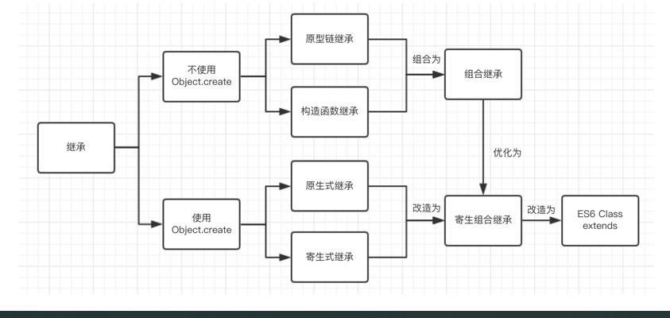

# 单体内置对象5.7
##### Global 
- 不属于任何其他对象的属性和方法,最终都是Global的属性和方法.
- 事实上,没有全局变量或全局函数;所有在全局作用域中定义的属性和函数,都是Global对象的属性.
```javascript
globalThis // = Window对象
```
#### URL 编码 URL解码

`encodeURIComponent`
`decodeURIComponent`
```javascript
 encodeURI()  // 替换空格为  %20 <=> decodeURI()
 encodeURIComponent() // 替换所有非字母数字字符 <=>  decodeURIComponent() // 推荐使用
 eval() // 不推荐使用
```
##### window对象 P133
- Web浏览器将Global对象作为window对象的一部分加以实现.在全局作用域中声明的所有变量和函数,就都成为了window对象的属性.
-
##### math对象 P134
- `Math.min(1,2,3,4,5)` // 1 返回一组数中的最小值.
- `Math.max(1,2,3,4,5)` // 5 返回一组数中的最大值.
- `const array1 = [1, 3, 2]`;
- `console.log(Math.max(...array1))`; // 返回数组中得最大值
- `Math.ceil(2.1)` // 3 向上取整
- `Math.floor(2.9)` // 2 向下取整
- `Math.round(number * 100)` / 100 四舍五入取2位小数
- `Math.round(2.4)` // 四舍五入取整
- `Math.random()` // 返回 0-1之间的一个随机数
- `Math.abs()` // 取绝对值

````javascript
  console.log(Math.random().toString().slice(-6)); // 生成随机6位整数 slice表示从倒数第6位开始截取
````

### 理解对象

### 继承
- P163 原型链继承: 问题: 引用类型值的原型属性会被所有实例共享,无法向父类传参
- P167 构造函数继承: 问题: 函数无法复用
- P168 组合继承: 经典继承方式. 问题:无论什么情况下,都会调用两次父类的构造函数.
- P169 原生式继承(浅拷贝继承): 问题: 引用类型值的属性始终都会共享相应的值
- P171 寄生式继承: 问题: 函数无法复用
- P172 寄生组合继承: => 完美并变为ES6的 Class extends

