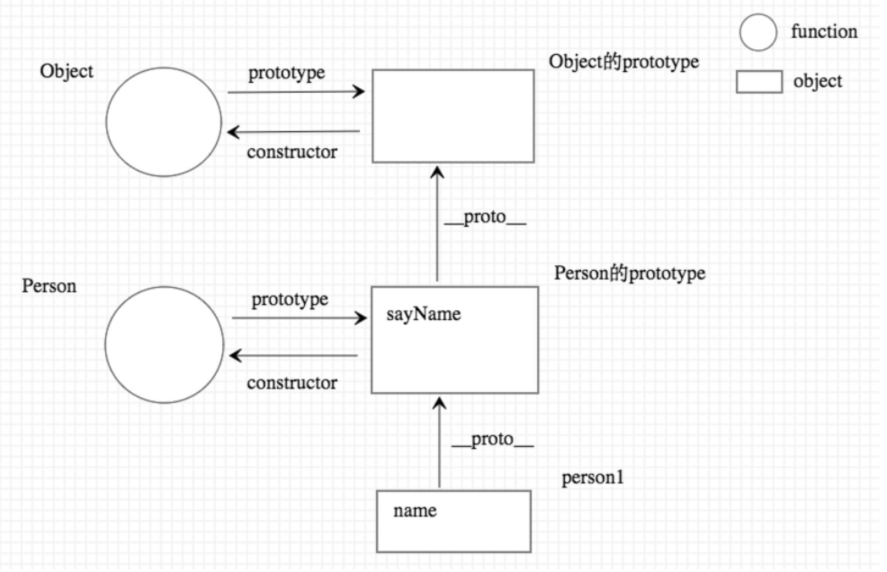

# proto 隐式原型

- [渡一](https://www.bilibili.com/video/BV1es4y1F7d6)
- 在 JavaScript 中，``__proto__`` 是一个对象的属性，它指向该对象的原型（prototype）。
- 它是 JavaScript 原型继承机制的核心组成部分，用于实现对象之间的继承和属性查找。
- ``所有的对象``都有一个内置的 ``__proto__`` 属性，该属性指向该对象的原型对象。
- 默认情况下,隐式原型指向创建该对象的函数的原型.
- 箭头函数也有``__proto__`` 属性,指向创建该函数的函数的原型.

