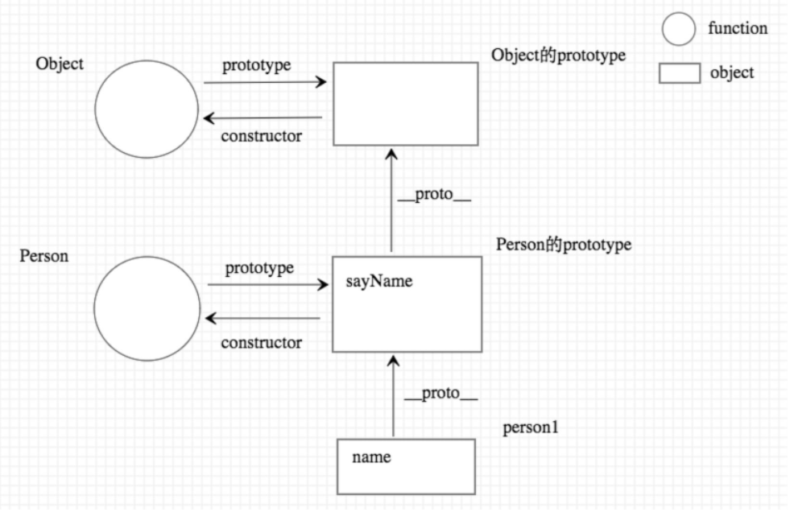

# prototype 原型
- 所有的对象都是通过 ``new 函数``创建的.
- 所有对象都是引用类型
- 这个函数称为对象的构造函数
- 所有的函数都是``对象``

```javascript
 const a = {}; // 等价于 cont a = new Object();
```


- 所有的``函数``都有一个属性: ``prototype``,称之为函数原型. (箭头函数除外)
- 箭头函数没有 ``prototype`` 属性
- 默认情况下: ``prototype`` 是一个普通的Object对象
- 默认情况下: ``prototype`` 中有一个属性, constructor, 它也是一个对象, 它指向构造函数
```javascript
function aaax(){}

aaax.prototype.constructor === aaax // true
```
  
