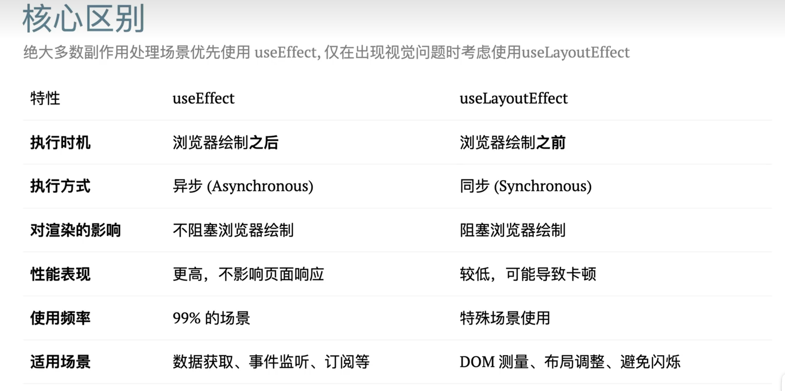

# useLayoutEffect
- [官网](https://zh-hans.react.dev/reference/react/useLayoutEffect)
- 在绘制前修改DOM
- 避免视觉闪烁
- 确保用户看到正确状态.
- 缺点: 阻塞浏览器绘制，可能导致页面卡顿,谨慎使用

## useLayoutEffect 的执行时机
- `同步执行`：`useLayoutEffect` 是在 React 完成 DOM 更新之后，但在浏览器进行绘制（paint）之前同步调用的。
- 阻塞渲染：它会阻塞浏览器的绘制过程。如果其中包含耗时操作，会导致页面卡顿。
- 适合需要立即修改 DOM 的场景：当你需要读取 DOM 布局信息（如元素尺寸、位置）并立即做出调整，以避免用户看到“闪烁”或“抖动”的视觉问题时使用。

## 执行顺序：

- 组件 render
- useLayoutEffect 执行（可以安全地读取/修改 DOM）
- 浏览器 `paint`（用户看到最终结果）
#### immer

#### 与 useEffect的区别

##### 解决dom闪烁的时候  2025年2月19日蚂蚁外包二面技术
- api与useEffect相同，但在所有DOM改变后``同步触发``。使用它来从DOM读取布局并同步重新渲染。在浏览器有机会绘制之前，将在useLayoutEffect内部计划的更新将同步刷新。
- 在可能的情况下首选标准`useEffect`以阻止视觉更新。
- 提示 如果你正在从类组件迁移代码，则useLayoutEffect会在与componentDidMount和componentDidUpdate相同的阶段触发，因此如果你不确定Hook要使用哪种效果，则他可能风险最小。

### 何时使用 useLayoutEffect？
- 只有当你发现使用 `useEffect` 导致了明显的视觉“闪烁”或布局跳动，并且需要在绘制前同步修正时才使用。常见场景包括：
    - 动画初始化（确保动画从正确位置开始） 
    - 工具提示（Tooltip）或弹窗（Popover）的位置计算 
    - 滚动位置的精确调整 
    - 依赖 DOM 布局信息的计算
### 原则：优先选择 useEffect，仅在必要时使用 useLayoutEffect。
