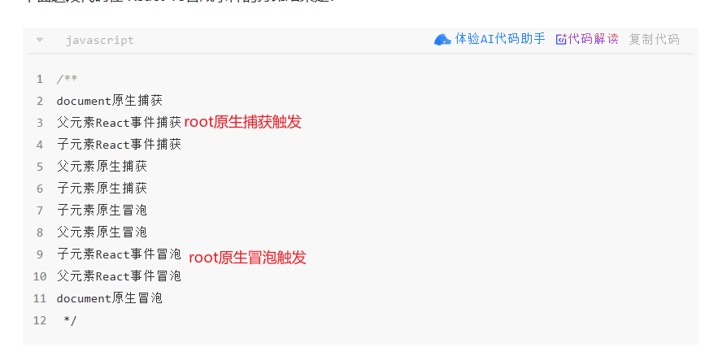
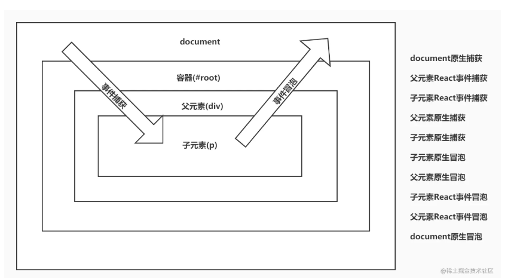

# React合成事件

- [掘金](https://juejin.cn/post/7183952097161773093)
- [B站珠峰公开课55-6.React合成事件](https://www.bilibili.com/video/BV1tK4y1R7Kt)

## 原生Dom事件流
1. 捕获阶段
2. 目标阶段
3. 冒泡阶段


## React事件与原生事件的差异


## React16合成事件
- React16把事件委托到document对象上.
- 当真实DOM元素触发事件,先处理原生事件,然后会冒泡到 ``document``对象后,再处理React事件
- React事件绑定的时刻是在 ``reconciliation(协调)``阶段,会在原生事件的绑定前执行.
- 目标和优势
  - 进行浏览器兼容,React采用的是顶层事件代理机制,能够保证冒泡一致性
  - 事件对象可能会被频繁创建和回收, 因此 React 引入事件池,再事件池中获取或释放事件对象(React17中废弃)
- 在视频17分钟处,有实现demo

```javascript
// event 是合成事件对象
// nativeEvent 是原生事件对象
event.nativeEvent.stopPropagation(); // 阻止向上冒泡,但本元素剩下的监听函数还会执行
event.nativeEvent.stopImmediatePropagation(); // 阻止向上冒泡,本元素剩下的监听函数不再执行
```


## React17:合成事件注册到挂载的容器了.
- 更改了事件委托
- 去除了事件池
  - 17版本中移除了事件对象池,这是因为React 在旧浏览器中重用了不同事件的事件对象,以提高性能,并将所有事件字段在它们之前设置为null.
  - 在React 16级更早版本中,使用者必须调用``event.presist()``才能正确的使用该事件,或者正确读取需要的属性.
- 在视频30分钟处,有实现demo
- 挂载的容器``root``.他捕获的时候就会触发 React的事件捕获
- 挂载的容器``root``.他冒泡的时候就会触发 React的事件冒泡
- 源码: [packages/react-dom/src/client/ReactDOMComponent.js](https://github.com/facebook/react/blob/main/packages/react-dom/src/client/ReactDOMComponent.js)
 


