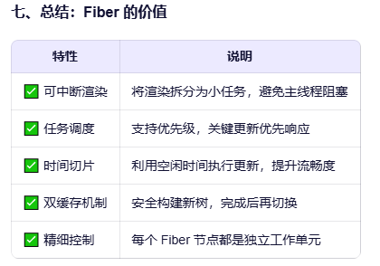
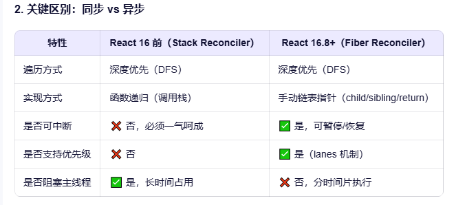
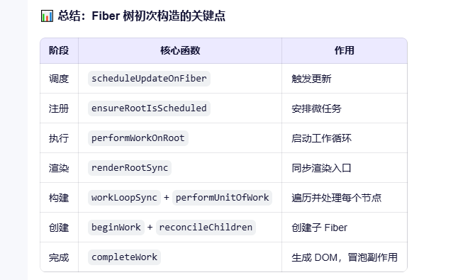

# Fiber架构的一切
- [B站面试口喷](https://www.bilibili.com/video/BV1ML411S7Fw)
- [掘金](https://juejin.cn/post/7427778132608172073)
## 什么是fiber架构
- 定义:描述了当前要创建的真实 dom 的一些信息，以及这个描述对象要做的操作】这个描述对象叫 ``fiber``
- 思想: 借鉴于计算机操作系统CPU的调度机制.
- 出现原因: 
  - react16()之前采用的递归方式(递归 + 调用栈)遍历 创建,更新虚拟DOM 递归的过程是不能中断的. ``堆栈调和（Stack Reconciliation）机制``
  - 递归这一过程可能占用很长时间. js又是单线程的.递归时UI渲染线程会一直处于等待中,导致页面卡顿.
  - 在React16.8中引入fiber架构, 创建和更新虚拟DOM采用``深度优先``, ``可中断``的遍历.
- 主要功能:
  1. ``动态优先级``
     - 给每个任务分配一个权重值.实现动态调整任务的执行顺序.优先级高的任务会先执行.
  2. ``可中断,可放弃(回滚)渲染``
     - 允许react渲染过程中对任务进行暂停.适当的时机进行重启.
     - 渲染过程分帧进行(使用了浏览器的2个api实现:requestAnimationFrame, requestIdleCallback)
     - 如果渲染时某任务的执行时间超过了当前帧的一个剩余时间,则进行任务暂停.保证不阻塞浏览器渲染.把控制器交给浏览器去执行UI渲染.下一帧再执行没有完成的任务.

## Fiber的结构: fiber节点树
- 在React的Fiber架构中，Fiber节点是构成Fiber树的基本单元，代表了React组件的虚拟DOM。
- 每个Fiber节点对应于屏幕上的某个组件或DOM元素，并且包含了渲染该组件或元素所需的所有信息。
- 每个Fiber是``独立``的工作单元，这使得渲染过程变得更容易调度。
- 遍历顺序: 父节点->子节点->兄弟节点(深度优先)
- https://juejin.cn/post/7427778132608172073#heading-5
- https://juejin.cn/post/7431122270641094675#heading-0

### 节点需要更新时:
- 除了用于显示当前UI的树``current``外，Fiber还会创建一个``workInProgress``树，变动的更新会在其上进行处理，处理完毕后用于下一次渲染，并替代之前的current树变为新的current树。

## 优先级是如何确定的?
- 在React Fiber架构中，优先级的确定是一个复杂而精细的过程，它涉及多种因素和策略。以下是对React Fiber中优先级确定方式的详细分析：

#### 一、优先级类型与划分

- React Fiber为不同的任务分配了不同的优先级，这些优先级通常根据任务的紧急程度和重要性来划分。常见的优先级类型包括：

1. **用户交互事件**：这类事件（如点击按钮、输入框输入等）触发的任务具有最高的优先级，因为它们直接影响用户体验，需要立即响应。
2. **动画和过渡效果**：动画和过渡效果的流畅性对用户体验也较为重要，因此其相关的任务优先级仅次于用户交互事件。
3. **数据加载和渲染**：从服务器获取数据以及初始页面的渲染等任务相对来说优先级较低，这些任务通常不会直接影响用户的即时交互体验。
4. **同步任务与异步任务**：同步任务（如需要立即执行以保证程序正常运行或满足用户当前交互需求的任务）的优先级高于异步任务（如延迟加载的数据请求或定时执行的任务）。

#### 二、动态调整优先级

- React Fiber的优先级调度机制不仅基于任务的类型，还会根据以下因素动态调整任务的优先级：
- https://juejin.cn/post/7441798757104861235
1. **截止时间临近**：如果某个任务有明确的截止时间，且临近截止时间时还未完成，那么该任务的优先级会相应提高。
2. **可见区域内的组件**：对于当前可见区域内的组件，其相关的任务优先级会相对较高，因为这些组件直接影响用户当前所看到的页面内容和交互体验。
3. **关键路径上的组件**：关键路径是指从应用启动到完成核心功能所必须经过的一系列组件和操作。关键路径上的组件更新任务会具有较高优先级。
4. **用户行为**：根据用户的操作行为和当前的交互场景，React会动态地调整任务的优先级。例如，当用户频繁地在页面的某个区域进行交互时，该区域相关组件的任务优先级会被进一步提高。
5. **性能状况**：如果系统检测到当前设备的性能状况不佳，React会适当降低一些非关键任务的优先级，以避免对系统性能造成更大的压力。

#### 三、优先级队列与调度策略

- React会根据上述的优先级确定规则，将不同的任务放入相应的优先级队列中。每个优先级队列对应一个特定的优先级级别，高优先级队列中的任务会优先得到处理。

- 在执行任务时，React的调度器会按照优先级队列的顺序依次处理任务。当高优先级队列中有任务时，低优先级队列中的任务会被暂时搁置，直到高优先级队列中的任务全部处理完毕。同时，调度器还会根据当前系统的资源状况和任务的紧急程度，合理分配时间片给不同优先级的任务，确保高优先级任务能够及时得到处理，同时也不会让低优先级任务长时间得不到执行。

#### 四、总结

- React Fiber通过综合考虑任务的类型、紧急程度、用户行为、系统性能等多种因素，动态地确定和调整任务的优先级。
- 这种优先级调度机制使得React能够更加智能地管理任务的执行顺序，在保证用户交互体验的同时，充分利用系统资源，提高应用的整体性能和响应速度。

# fiber树是如何进行遍历的?
React 的 Fiber 树遍历是其协调（Reconciliation）算法的核心，它采用了一种**深度优先、可中断的遍历策略**，这与传统的递归遍历有本质区别。这种设计是为了实现 **“可中断渲染”** 和 **“高优先级任务抢占”**。
Fiber 树的遍历主要分为两个大的阶段：**Render/Reconciliation 阶段** 和 **Commit 阶段**。我们重点讨论第一个阶段的遍历机制。

### 1. Fiber 节点的关键指针

理解遍历之前，必须了解 Fiber 节点上的几个核心指针：

*   `child`: 指向第一个子节点。
*   `sibling`: 指向下一个兄弟节点。
*   `return`: 指向父节点（或更准确地说，是返回路径上的节点）。
*   `alternate`: 指向对应于上一次渲染的 Fiber 节点（用于双缓冲和对比变更）。

这些指针将组件树从一个单纯的父子结构，变成了一个可以高效遍历和更新的链表式数据结构。

### 2. Render/Reconciliation 阶段的遍历过程 (深度优先 + 可中断)

这个阶段的目标是找出需要更新的地方，并构建一个包含所有变更的 **Effect List**。遍历是通过一个循环（而不是递归）完成的，这使得它可以被浏览器的调度器中断。

#### 遍历算法逻辑

想象 React 维护着一个当前正在处理的 Fiber 节点（`workInProgress`）。遍历过程如下：

1.  **向下遍历 (Down - "beginWork")**
    *   从根节点开始。
    *   对当前节点执行 `beginWork`。这会根据组件类型（函数组件、类组件、DOM 元素等）进行相应的处理：
        *   对于函数组件：调用函数体，执行其中的所有 Hook。
        *   对于类组件：调用 `render()` 方法。
        *   对于 DOM 元素：准备创建或更新 DOM。
    *   `beginWork` 的结果是生成一组新的子 Fiber 节点（作为链表）。
    *   如果有 `child`，则将 `workInProgress` 设置为 `child`，继续向下遍历。这是“深度优先”的体现。

2.  **横向遍历 (Right - "sibling")**
    *   当到达一个**叶子节点**（没有 `child`），或者某个节点的 `beginWork` 完成后没有产生子节点时，遍历需要回溯。
    *   此时，检查当前节点是否有 `sibling`。
    *   如果有 `sibling`，则将 `workInProgress` 设置为 `sibling`，回到步骤 1，处理下一个兄弟节点。

3.  **向上回溯 (Up - "completeWork" & "return")**
    *   当一个节点既没有 `child` 也没有 `sibling` 时（即处理完了一个子树的所有兄弟节点），就需要向上回溯到父节点。
    *   在回溯之前，对当前节点执行 `completeWork`。这个函数很重要：
        *   对于 DOM 节点：在这里真正创建 DOM 元素，并将子节点附加到它上面。
        *   收集副作用（Side Effects）：如果当前节点或其子树有任何需要在 Commit 阶段处理的变更（如 props 改变、需要插入/删除 DOM、有 `useEffect` 等），就将该节点标记为有副作用，并将其**添加到 Effect List 中**。
    *   执行完 `completeWork` 后，将 `workInProgress` 设置为 `return`（父节点），然后重复步骤 2（检查父节点是否有 `sibling`）。

4.  **完成**
    *   当回溯到根节点，并且根节点也完成了 `completeWork`，整个 Render 阶段结束。
    *   此时，Effect List 已经构建完成，包含了所有需要在 Commit 阶段应用的变更。

#### 关键特性：可中断

*   整个遍历是在一个 **while 循环**中进行的，而不是递归。
*   浏览器的调度器（如 `requestIdleCallback` 或 `Scheduler` 包）可以监控这个循环的执行时间。
*   如果当前帧的时间片快用完了，或者有更高优先级的任务（如用户输入）到来，React 可以**暂停**这个遍历循环，让出主线程。
*   当 React 再次获得控制权时，它可以从上次暂停的地方（即 `workInProgress` 指向的节点）**恢复**遍历，因为所有的状态都保存在 Fiber 节点的链表结构中。

### 3. Commit 阶段的遍历

*   这个阶段是**不可中断**的，必须同步完成，以保证 UI 更新的原子性。
*   React 直接遍历在 Render 阶段构建好的 **Effect List**（这是一个链表，连接了所有有副作用的 Fiber 节点）。
*   按顺序执行所有副作用：
    *   **Mutation 阶段**：执行 DOM 插入、更新、删除。
    *   **Layout 阶段**：调用 `useLayoutEffect` 的清除函数和回调函数，以及类组件的 `componentDidUpdate` 等。
    *   **Passive 阶段**：调用 `useEffect` 的清除函数和回调函数（这个阶段可以异步延迟）。

### 总结

Fiber 树的遍历是一个精巧的、基于指针的深度优先搜索：

1.  **向下 (`child`)**：进入子节点。
2.  **向右 (`sibling`)**：处理兄弟节点。
3.  **向上 (`return`)**：回溯到父节点，并在回溯时执行 `completeWork` 来收集副作用。

这种遍历方式结合了 **循环而非递归** 的实现，使得 React 能够实现**可中断的渲染**，极大地提升了复杂应用的响应性能。Effect List 的构建也是在这个遍历过程中完成的，它是连接 Reconciliation 和 Commit 两个阶段的桥梁。
