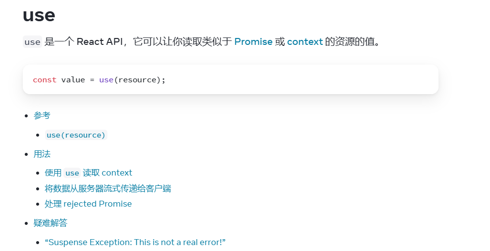

# use
- react19新特性
- use 是一个 React API，它可以让你读取类似于 Promise 或 context 的资源的值。
- [官网](https://zh-hans.react.dev/reference/react/use)
```jsx
import { use } from 'react';

const value = use(resource);
```
- 与 React Hook 不同的是，可以在循环和条件语句（如 if）中调用 use。但需要注意的是，调用 use 的函数仍然必须是一个组件或 Hook。

