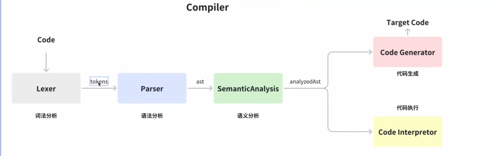

# JavaScript的执行机制
- [B站](https://www.bilibili.com/video/BV1XDHzzTEWF)
- 2025年9月27日-12:37

#### JavaScript是解释型语言还是编译型语言?
- ``即时编译(Just-In-Time, JIT)语言``: 混合了编译和解释执行.

#### 引擎
- V8: Chrome浏览器的JS引擎.
- blink: Chrome浏览器的渲染引擎.

#### 执行过程
- 第一步 解析: JS源代码 通过 解析器(parser) 转换成 抽象语法树(AST)
  - https://astexplorer.net/ 查看AST
- 第二步 解释: AST 通过 基准解释器(Igniton) 生成 字节码(bytecode)
- 第三步 编译: 字节码 通过 编译器(compiler) 转换成 机器代码

#### 代码执行过程
- 调用栈: 一个后进先出(LIFO)的栈结构,专门用来存储和管理执行上下文.
- 当JS代码开始执行时:
    1. 全局执行上下文(GEC) 被创建并压入调用栈底.
    2. 每当调用一个函数时,该函数的执行上下文(FEC) 被创建并压入栈顶.
    3. 当函数执行完毕并返回时,它的执行上下文会从栈顶被弹出.
    4. 所有代码执行完毕后,调用栈清空.
