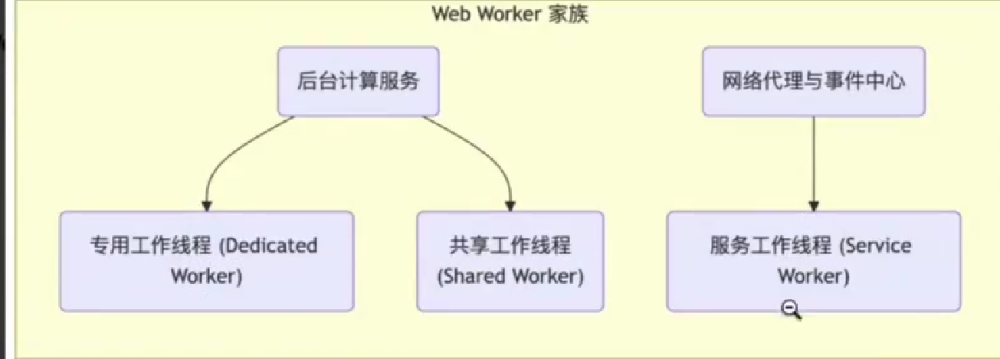
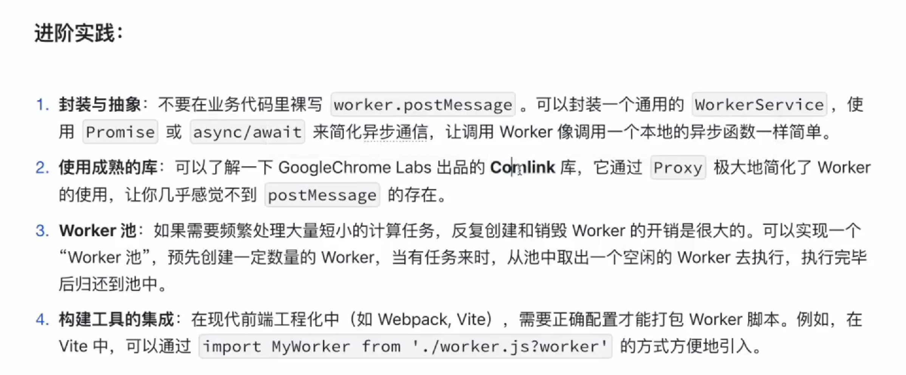

# webWorker的一切 
<http://www.ruanyifeng.com/blog/2018/07/web-worker.html>

## 理论知识
#### 简洁

*   虽然JS是单线程，但是ES6以后有一个Web Worker，可以开启一个新线程.使得Js有了多线程的环境.
*   允许主线程创建 Worker 线程,将一些任务分配给后者运行.两者互不干扰.
*   等到 Worker 线程完成计算任务,再把结果返回给主线程.
*   一些计算密集型或高延迟的任务，被 Worker 线程负担了，主线程（通常负责 UI 交互）就会很流畅，不会被阻塞或拖慢。
*   Worker 线程一旦新建成功，就会始终运行，不会被主线程上的活动（比如用户点击按钮、提交表单）打断。这样有利于随时响应主线程的通信。但是，这也造成了 Worker 比较耗费资源，不应该过度使用，而且一旦使用完毕，就应该关闭。

#### 限制条件

1.  同源限制:
    分配给 Worker 线程运行的脚本文件，必须与主线程的脚本文件同源。
2.  DOM限制: Worker 线程所在的全局对象，与主线程不一样，无法读取主线程所在网页的 DOM 对象，也无法使用document、window、parent这些对象。但是，Worker 线程可以使用navigator对象和location对象。
3.  通信联系: Worker 线程和主线程不在同一个上下文环境，它们不能直接通信，必须通过消息完成。
4.  脚本限制: Worker 线程不能执行alert()方法和confirm()方法，但可以使用 XMLHttpRequest 对象发出 AJAX 请求。
5.  文件限制: Worker 线程无法读取本地文件，即不能打开本机的文件系统（file://），它所加载的脚本，必须来自网络。

#### 基本用法

1.  new Worker('work.js');

<!---->

     var worker = new Worker('work.js');
     主线程采用new命令，调用Worker()构造函数，新建一个 Worker 线程

1.  Worker()构造函数的参数是一个脚本文件，该文件就是 Worker 线程所要执行的任务。由于 Worker 不能读取本地文件，所以这个脚本必须来自网络。如果下载没有成功（比如404错误），Worker 就会默默地失败。
2.  主线程向 Worker 发消息,接收消息,关闭 Worker

```
 worker.postMessage('Hello World');
 worker.postMessage({method: 'echo', args: ['Work']});
 
 worker.onmessage = function (event) {
    console.log('Received message' + event.data);
 }
 
  worker.terminate(); // 关闭worker线程
 
```

1.  Worker 线程 监听消息 发送消息 关闭自身

<!---->

     self.addEventListener('message', function (e) {
      self.postMessage('You said: ' + e.data);
    }, false);
    // self代表子线程自身，即子线程的全局对象。因此，等同于下面两种写法。
    // 写法一
    this.addEventListener('message', function (e) {
      this.postMessage('You said: ' + e.data);
    }, false);

    // 写法二
    addEventListener('message', function (e) {
      postMessage('You said: ' + e.data);
    }, false);

    self.close(); // 在 Worker 内部关闭自身

1.  除了使用self.addEventListener()指定监听函数，也可以使用self.onmessage指定。监听函数的参数是一个事件对象，它的data属性包含主线程发来的数据。self.postMessage()方法用来向主线程发送消息。
2.  Worker 加载脚本

<!---->

     Worker 内部如果要加载其他脚本，有一个专门的方法importScripts()。
     importScripts('script1.js');
     importScripts('script1.js', 'script2.js'); 
     // 同时加载多个

1.  错误处理: 主线程可以监听 Worker 是否发生错误。如果发生错误，Worker 会触发主线程的error事件。

<!---->

      worker.onerror(function (event) {
      console.log([
        'ERROR: Line ', e.lineno, ' in ', e.filename, ': ', e.message
      ].join(''));
    });

    // 或者
    worker.addEventListener('error', function (event) {
      // ...
    });
    // Worker 内部也可以监听error事件。

#### 数据通信

1.  前面说过，主线程与 Worker 之间的通信内容，可以是文本，也可以是对象。需要注意的是，这种通信是拷贝关系，即是传值而不是传址，Worker 对通信内容的修改，不会影响到主线程。事实上，浏览器内部的运行机制是，先将通信内容串行化，然后把串行化后的字符串发给 Worker，后者再将它还原。
2.  传递二进制数据:主线程与 Worker 之间也可以交换二进制数据，比如 File、Blob、ArrayBuffer 等类型，也可以在线程之间发送。

<!---->

     // 主线程
    var uInt8Array = new Uint8Array(new ArrayBuffer(10));
    for (var i = 0; i < uInt8Array.length; ++i) {
      uInt8Array[i] = i * 2; // [0, 2, 4, 6, 8,...]
    }
    worker.postMessage(uInt8Array);

    // Worker 线程
    self.onmessage = function (e) {
      var uInt8Array = e.data;
      postMessage('Inside worker.js: uInt8Array.toString() = ' + uInt8Array.toString());
      postMessage('Inside worker.js: uInt8Array.byteLength = ' + uInt8Array.byteLength);
    };

1.  Transferable Objects: 拷贝方式发送二进制数据，会造成性能问题。比如，主线程向 Worker 发送一个 500MB 文件，默认情况下浏览器会生成一个原文件的拷贝。为了解决这个问题，JavaScript 允许主线程把二进制数据直接转移给子线程，但是一旦转移，主线程就无法再使用这些二进制数据了，这是为了防止出现多个线程同时修改数据的麻烦局面。这种转移数据的方法，叫做Transferable Objects。这使得主线程可以快速把数据交给 Worker，对于影像处理、声音处理、3D 运算等就非常方便了，不会产生性能负担。

<!---->

     // 如果要直接转移数据的控制权，就要使用下面的写法。
     // Transferable Objects 格式
        worker.postMessage(arrayBuffer, [arrayBuffer]);
     // 例子
        var ab = new ArrayBuffer(1);
        worker.postMessage(ab, [ab]);

#### 同页面的 Web Worker

通常情况下，Worker 载入的是一个单独的 JavaScript 脚本文件，但是也可以载入与主线程在同一个网页的代码。

     <!DOCTYPE html>
      <body>
        <script id="worker" type="app/worker">
          addEventListener('message', function () {
            postMessage('some message');
          }, false);
        </script>
      </body>
    </html>

上面是一段嵌入网页的脚本，注意必须指定&lt;script&gt;标签的type属性是一个浏览器不认识的值，上例是app/worker。
然后，读取这一段嵌入页面的脚本，用 Worker 来处理。

     var blob = new Blob([document.querySelector('#worker').textContent]);
     var url = window.URL.createObjectURL(blob);
     var worker = new Worker(url);
     worker.onmessage = function (e) {
      // e.data === 'some message'
     };

上面代码中，先将嵌入网页的脚本代码，转成一个二进制对象，然后为这个二进制对象生成 URL，再让 Worker 加载这个 URL。这样就做到了，主线程和 Worker 的代码都在同一个网页上面。

#### 实例: Worker线程完成轮询

1.  有时，浏览器需要轮询服务器状态，以便第一时间得知状态改变。这个工作可以放在 Worker 里面。
    上面代码中，Worker 每秒钟轮询一次数据，然后跟缓存做比较。如果不一致，就说明服务端有了新的变化，因此就要通知主线程。

#### 实例: Worker 新建 Worker

1.  Worker 线程内部还能再新建 Worker 线程（目前只有 Firefox 浏览器支持）。下面的例子是将一个计算密集的任务，分配到10个 Worker。

#### API

1.  浏览器原生提供的 Worker() 构造函数, 用来供主线程生成 Worker 线程

```javascript


     var myWorker = new Worker(jsUrl, options);
     // Worker()构造函数，可以接受两个参数。第一个参数是脚本的网址（必须遵守同源政策），该参数是必需的，且只能加载 JS 脚本，否则会报错。第二个参数是配置对象，该对象可选。它的一个作用就是指定 Worker 的名称，用来区分多个 Worker 线程。
     
     // 主线程
    var myWorker = new Worker('worker.js', { name : 'myWorker' });
    // Worker 线程
    self.name // myWorker
```
1.  Worker()构造函数返回一个 Worker 线程对象，用来供主线程操作 Worker。Worker 线程对象的属性和方法如下。

*   Worker.onerror：指定 error 事件的监听函数。
*   Worker.onmessage：指定 message 事件的监听函数，发送过来的数据在Event.data属性中。
*   Worker.onmessageerror：指定 messageerror 事件的监听函数。发送的数据无法序列化成字符串时，会触发这个事件。
*   Worker.postMessage()：向 Worker 线程发送消息。
*   Worker.terminate()：立即终止 Worker 线程。

1.  Web Worker 有自己的全局对象，不是主线程的window，而是一个专门为 Worker 定制的全局对象。因此定义在window上面的对象和方法不是全部都可以使用。

Worker 线程有一些自己的全局属性和方法。

*   self.name： Worker 的名字。该属性只读，由构造函数指定。
*   self.onmessage：指定message事件的监听函数。
*   self.onmessageerror：指定 messageerror 事件的监听函数。发送的数据无法序列化成字符串时，会触发这个事件。
*   self.close()：关闭 Worker 线程。
*   self.postMessage()：向产生这个 Worker 线程发送消息。
*   self.importScripts()：加载 JS 脚本。


## 创建 WebWorker时,如何不指定特定的文件
- B站渡一
```javascript
const code = `console.log('worker')`;
// 1. Object URL
 const blob = new Blob([code], { type: 'application/javascript' });
 const worker = new Worker(URL.createObjectURL(blob));
// 2. Data Url
const dataURL = `data:application/javascript;utf8,${code}`;
const worker = new Worker(dataURL);
```

- 本质上就是创建一个js文件流给 Worker

## webworker的使用场景
- CPU 密集型计算
- 海量数据解析
- 公式编辑器,执行器
- 后台数据预加载与缓存
- 实现一个独立的 ``心跳``或轮询服务
- 大文件分片, 多线程上传.(单独的博客文章)

## 实战-识别二维码
*   webworker解决jsQr执行慢,耗费性能的问题
*   jsQr解决图片二维码识别问题

#### 直接上代码

主线程
```javascript

    export default function readImageQrCode(src){
    // src 就是url图片地址或者base64 图片地址
        return new window.Promise( (resolve, reject) => {
            let imgDom = new Image();
            imgDom.src = src;
            imgDom.onload =  () => {
                const canvas = document.createElement('canvas');
                // 要保证宽高可以完全包裹住图片的宽高（踩过坑）
                canvas.width = imgDom.width;
                canvas.height = imgDom.height;
                const ctx = canvas.getContext('2d');
                // 将图片画到 canvas 上
                ctx.drawImage(imgDom, 0, 0, imgDom.width, imgDom.height)
                // 从 canvas 中提取像素数据
                const imageData = ctx.getImageData(0, 0, canvas.width, canvas.height);
                // 将像素数据作为输入，使用 jsQR 库进行解码
                const workerJsPath = '/qrWorker.js';
                let worker = new Worker(workerJsPath);
                worker.postMessage({
                    data: imageData.data,
                    width: imageData.width,
                    height: imageData.height,
                });
                worker.onmessage = function (event) {
                    if(event){
                        let code = event.data;
                        resolve(code && code.data || '');
                    }
                }
            }
            imgDom.onerror = function (){
                reject('');
            }
        })
    }
```

qrWorker.js

```javascript
importScripts('jsQR.js');
// https://github.com/cozmo/jsQR/blob/master/dist/jsQR.js
// 使用jsQR识别图片中的二维码.
self.addEventListener('message', function (e) {
    const imageData = e.data;
    const code = jsQR(imageData.data, imageData.width, imageData.height);
    console.log('使用jsQR扫描图片中的二维码成功', code);
    self.postMessage(code);
}, false);

```

使用
```javascript

    	readImageQrCode(info.url)
    		.then((res) => {
    		    console.log(res);
    		})
    		.catch((err) => {
    			
    		});
```
#### webWorker 家族

#### 进阶

#### 相关文档
[借助jsQR简简单单在H5中识别图片中的二维码](https://juejin.cn/post/7218506966545186877)
[jsQR下载](https://github.com/cozmo/jsQR/blob/master/dist/jsQR.js)


