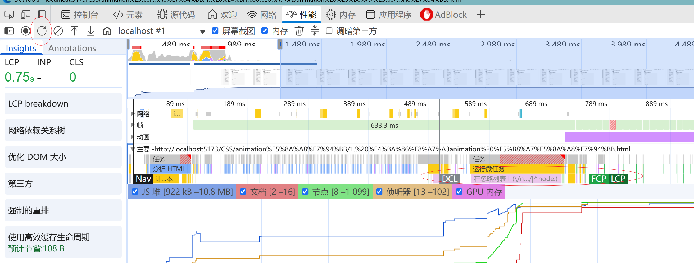

# 前端性能优化指标
- [B站](https://www.bilibili.com/video/BV1LfwVeZEYN)
- DCL: Document Content Loaded 文档内容加载完成: 浏览器完成对页面的解析和加载，此时 DOM 已经生成，但图片、样式、脚本等资源可能尚未加载完成。
- L: Load: 浏览器完成加载页面的全部内容，包括 DOM、图片、样式、脚本等。
- FCP: First Content Paint 首次内容绘制: FCP 指的是浏览器首次渲染出页面内容的时间点。这里的“内容”通常指的是文本、图片、SVG、canvas 元素等用户可见的内容（不包括空白的背景或边框）。
- FP: First Paint 首次绘制: 首次绘制指浏览器完成第一次绘制页面内容（包含文本、图片、SVG、canvas 元素等用户可见的内容）。
- LCP: Largest Contentful Paint 最大内容绘制: LCP 指的是用户在页面上能够看到的最大内容（例如图片、文本、视频等）。LCP 值越小，页面加载速度就越快。

## 整个加载流程
```text
[ navigationStart ]
        ↓
    DNS Lookup → TCP Connect → TLS (if HTTPS)
        ↓
    Request → Response (TTFB)
        ↓
    HTML Download → HTML Parse (domLoading)
        ↓
    FCP (用户看到第一块内容)
        ↓
    DOM 构建完成 → domInteractive
        ↓
    DOMContentLoaded (DCL) ← 可操作 DOM
        ↓
    资源加载（CSS、JS、图片）
        ↓
    LCP (主内容出现)
        ↓
    domComplete → window load (所有资源加载完)
        ↓
    onloadEvent → 页面完全就绪
```
