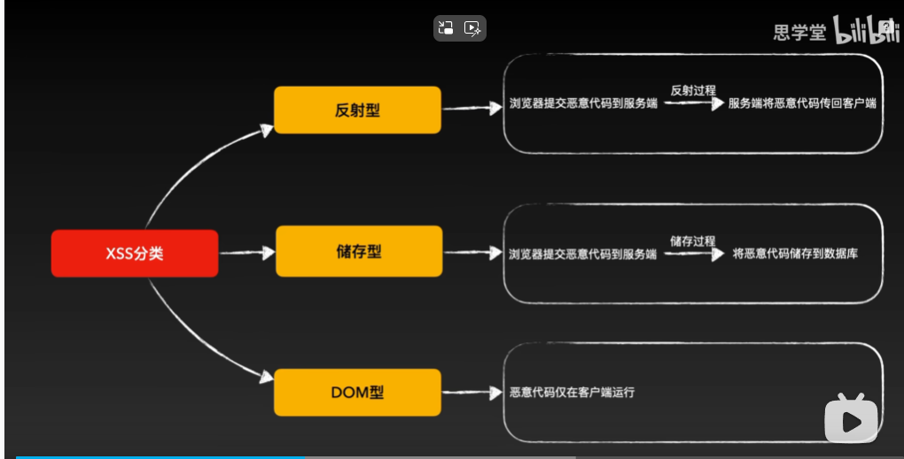
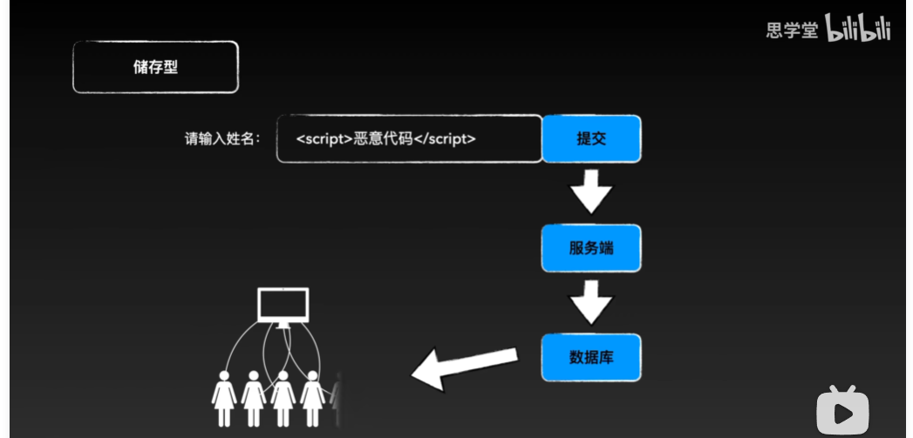
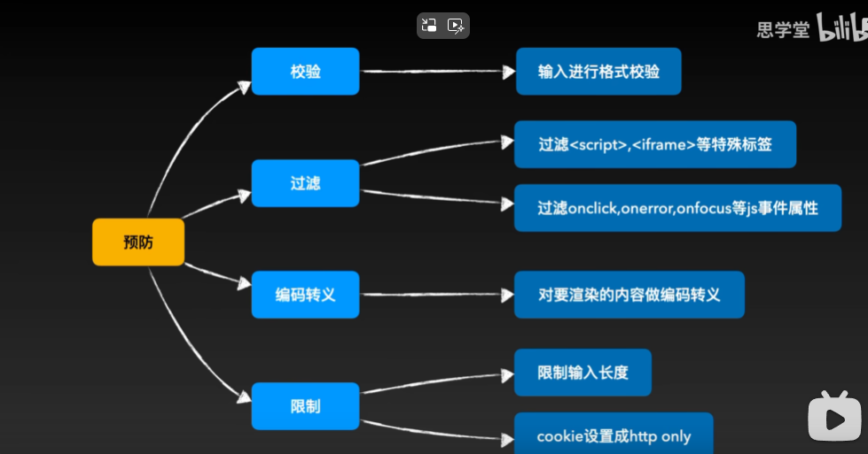

# XSS攻击
- [B站](https://www.bilibili.com/video/BV1Qd4y1k7K4)
- XSS(Cross-Site Scripting) 跨站脚本攻击
- 千方百计的注入并执行恶意脚本

## 危害
- 窃取cookie
- 劫持流量
- 插入广告
- 置入木马
- 获取用户信息

## 注入方式
- url参数注入
- 输入框注入

## 分类
- 反射型
- 储存型
- DOM型


- 反射型和DOM型的注入方式: 用户点击 链接时, 浏览器会向服务器发送请求, 服务器会返回一个包含恶意代码的页面.
```txt
http://xxx.com?kid=<script>恶意代码</script>
```
- 储存型注入方式


## 预防
- 输入过滤
- 输出转义

