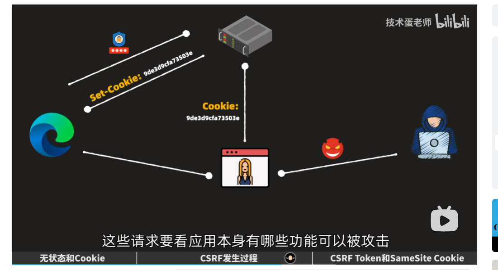

# CSRF攻击
- Cross Site Request Forgery 跨站请求伪造
- 任何发往你应用域名的请求，只要用户已登录，都会自动携带认证信息。
- [B站-技术蛋老师](https://www.bilibili.com/video/BV1UH4y1M7Dg)

## 如何防范
1. CSRF Token
   - 服务器生成一个随机的token,并保存在session中,并返回给用户.
   - 用户请求时,将token放在请求头中,服务器验证token是否一致.
   - 此令牌避免存储在``cookie``中
2. SameSite Cookie(推荐方式)
    - SameSite=Strict 服务器设置cookie的SameSite属性为``Strict``(不允许跨站传输cookie)
    - SameSite=Lax 服务器设置cookie的SameSite属性为``Lax``(允许跨站请求,但仅限于GET请求,POST请求会忽略)
3. Secure(HTTPS)
   - SameSite=None; Secure 若SameSite 属性为None,则必须设置Secure属性为true.
   - 服务器设置cookie的Secure属性为true,表示cookie只能通过HTTPS传输.
   - 浏览器会自动忽略非HTTPS请求,不会发送cookie.
