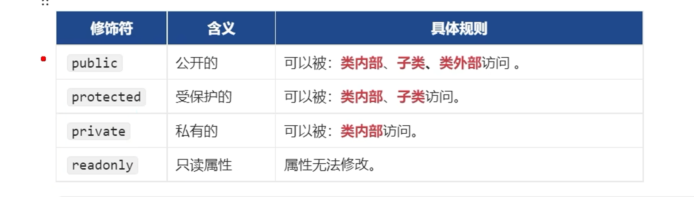

# TypeScript 基础-下篇
-[B站](https://www.bilibili.com/video/BV1YS411w7Bf?spm_id_from=333.788.videopod.episodes&vd_source=fd2259d65d6b765562dfc7be43d3480e&p=3)
### 类 class

```typescript
class Person {
    name: string
    age: number

    constructor(name: string, age: number) {
        this.name = 'zsz';
        this.age = 18;
    }
    speak() {
        console.log(this.age, this.name);
    }
}

class Student extends Person { // 继承 Student 是 Person 的子类
    grade: string

    constructor(name: string, age: number, grade: string) {
        super(name, age);
        this.grade = grade;
    }
    override speak() { // 重写父类方法
        console.log(this.age, this.name, this.grade);
    }
}
const s1 = new Student('zsz', 11, '一年级');
```
- 类的属性修饰符
- public (默认) 可以修饰属性或方法

- 类属性的简写形式, 以下代码意义相同


### abstract class 抽象类
- 只能用于被继承, 不能被实例化
- 何时使用抽象类?
    1. 定义``通用接口``: 为一组相关的类定义通用的行为(方法或属性) 时.
    2. 提供``基础实现``: 在抽象类中提供某些方法或为其提供基础实现,这样派生类就可以继承这些实现.
    3. 确保``关键实现``: 强制派生类实现一些关键行为.
    4. ``共享``代码和逻辑: 当多个类需要共享部分代码时,抽象类可以避免代码重复.

### class  implements 类实现接口
- 通过接口 限制了 类的实现
```typescript
interface PersonInterface {
	name: string
	age: number
	speak(n: number): void
}
class Person implements PersonInterface, XXXIntercace { // 可以实现多个接口
    name: string
    age: number
    speak(n: number): void {
        console.log('n', n)
    }
}
interface UserInterface {
 name: string
 readonly gender: string // 只读属性
}
```
### 接口之间的继承
```typescript
interface PersonInterface {
    name: string
    age: number
}
interface StudentInterface extends PersonInterface {
    grade: number
}
```
### 接口的可合并性(可重复定义)
```typescript
interface PersonInterface {
    name: string
}
interface PersonInterface {
    age: number
}
// 合并后 等效于以下代码
interface PersonInterface {
    name: string
    age: number
}
```
### interface与type的区别
- 相同点: 都可以用来定义类型, 两者在许多场景中是可以互换的.
- 不同点:
    - interface: 更专注于定义对象和类的结构,支持继承 和 合并.
    - type: 可以定义``类型别名``,``联合类型``,``交叉类型``, 但不支持继承和自动合并.

### interface 与抽象类的区别
- 相同点: 都用于定义一个``类的格式`` (应该遵循的契约)
- 不相同:
    1. 接口: 只能描述``结构``, 不能有任何``实现代码``, 一个类可以实现多个接口.
    2. 抽象类: 既可以包含``抽象方法``,也可以包含``具体方法``,一个类只能继承一个抽象类

### 泛型
- 泛型允许我们定义函数,类或接口时,使用类型参数来表示未指定的类型,这些参数在具体使用时,
- 才被指定为具体的类型. 泛型能让同一段代码适用于多种类型,提高代码的复用性和灵活性.同时仍然保持类型的安全性.
```typescript
function identity<T, U>(arg: T, x: U): T | U {
    return arg || x;
}
let output = identity<string>("myString");

```
#### 泛型接口
- 泛型接口可以定义一个函数类型, 并允许在使用时指定具体的类型参数.
```typescript
interface GenericIdentityFn<T> {
    (arg: T): T;
}
function identity<T>(arg: T): T {
    return arg;
}
```
#### 泛型类
- 泛型类允许我们定义一个类,并在实例化时指定具体的类型参数.
```typescript
class GenericNumber<T> {
    zeroValue: T;
    add: (x: T, y: T) => T;
}
    let myGenericNumber = new GenericNumber<number>();
    myGenericNumber.zeroValue = 0;
    myGenericNumber.add = function(x, y) { return x + y; };
```
### 类型声明文件 xx.d.ts
- 类型声明文件是用来描述JavaScript代码的类型信息的文件,通常以.d.ts为后缀.
- 类型声明文件可以被TypeScript编译器用来检查JavaScript代码的类型错误,并提供自动补全和文档提示等功能.
```javascript 
// demo.js
export function add(a, b) {
    return a + b;
}

```
```typescript
// demo.d.ts
export declare function add(a: number, b: number): number;

```
- 这样在引入 demo.js 时,就可以使用类型声明文件中的类型信息了.
