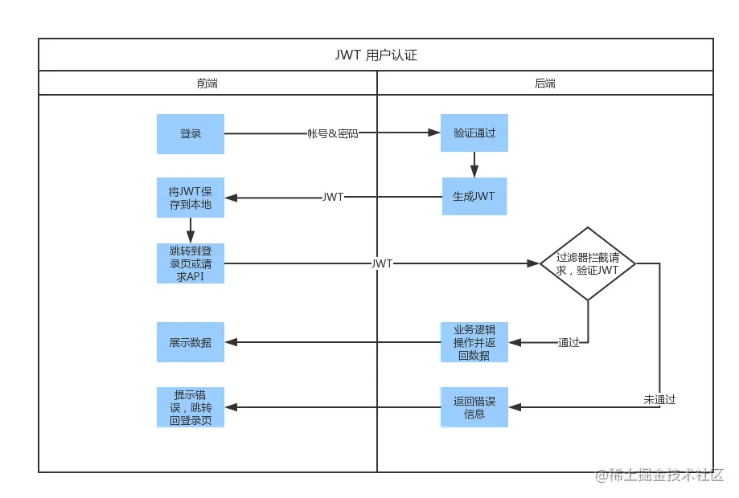

# JWT(Json Web Token)(网络安全)
- https://juejin.cn/post/7110044736848658445
- https://www.bilibili.com/video/BV1ffPae4EhJ
### JWT是什么?

- 本质: 一个字符串 并且用.分割成三部分. header.payload.signature
- 构成:第一部分我们称它为头部（header),第二部分我们称其为载荷（payload, 类似于飞机上承载的物品)，第三部分是签证（signature).
- 不是加密,不是加密,不是加密. 就是明文传输 (单独加密payload是另外回事)
- 服务端将JWT字符串作为登录成功的返回结果返回给客户端
- 客户端在每次请求时将JWT放入HTTP Header中的Authorization位。(解决XSS和XSRF问题)
- 服务端对收到的JWT进行解密和校验，如检查签名是否正确、Token是否过期、Token的接收方是否是自己等。
- 验证通过后服务端使用JWT中包含的用户信息进行其他逻辑操作，返回相应结果，否则返回401。

### JWT的优势
##### 无状态
- JWT 自身包含了身份验证所需要的所有信息，因此，我们的服务器不需要存储 Session 信息。这显然增加了系统的可用性和伸缩性，大大减轻了服务端的压力。

##### 有效避免了CSRF 攻击
- 使用 JWT 进行身份验证不需要依赖 Cookie ，因此可以避免 CSRF (Cross Site Request Forgery: 跨站请求伪造） 攻击.

##### 适合移动端应用
-  不需要cookie 所以适用移动端, 且 JWT 可跨语言使用.
##### 单点登录友好
- 同上
##### JWT的缺点
- 不可控

