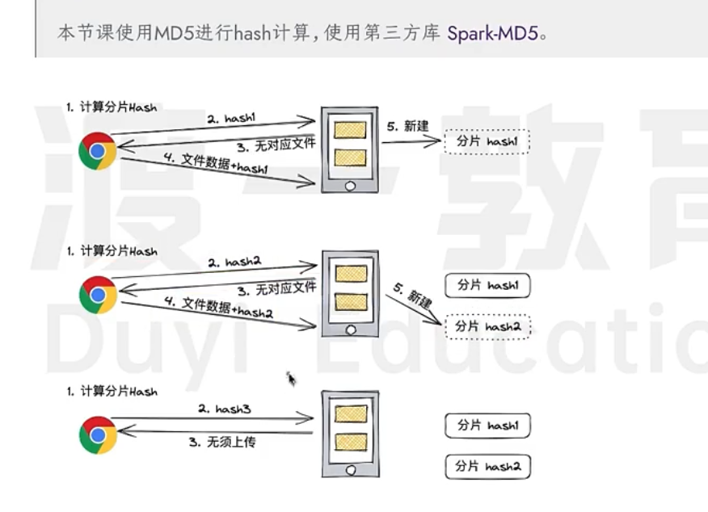

# 大文件上传
- 大师课-03-大文件的分片与优化.mp4
- 核心难点: 1. 分片上传 2. 断点续传 3. 优化上传

# 主要问题
1. 如何减少页面阻塞
2. 前后端如何协调
3. 代码如何组织
4. 前端代码中的复杂逻辑

## 1. 如何减少页面阻塞
- 利用hash对比分片 (常见的hash算法: `md5`, `sha1`, sha256, sha512); md5第三方库 ``Spark-MD5``;
- 相同的内容块只上传一次

