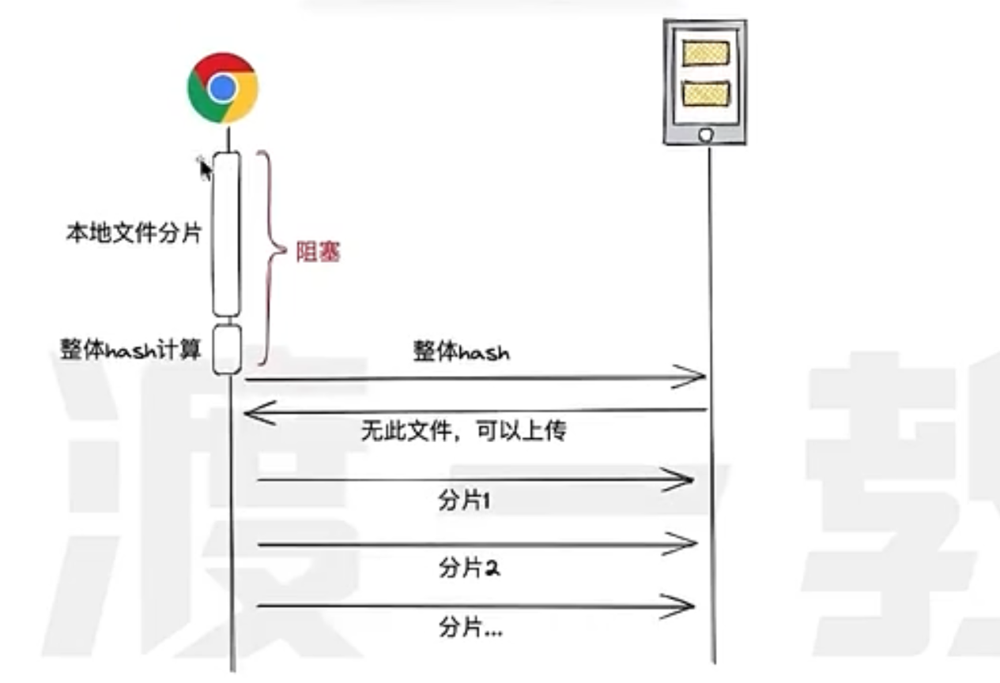

# 大文件上传
- 大师课-03-大文件的分片与优化.mp4
- 核心难点: 1. 分片上传 2. 断点续传 3. 优化上传

## http文件上传数据格式
- Content-Type: multipart/form-data // form表单
- Content-Type: application/octet-stream // 二进制流
- Content-Type: application/json // base64 json格式
## 主要问题
1. 如何减少页面阻塞
2. 前后端如何协调: 视频第30:00
3. 代码如何组织
4. 前端代码中的复杂逻辑

### 技术方案
- 利用hash对比分片 (常见的hash算法: `md5`, `sha1`, sha256, sha512); md5第三方库 ``Spark-MD5``;
- 相同的内容块只上传一次

- 这样会造成阻塞. 可以大胆假设: 绝大部分文件的上传都是新文件上传. 直接开始分片传输.

- 分片操作可以使用多线程() + 异步的方式进行上传处理
    1. 对于新文件上传可以缩短整体上传时间,消除页面的阻塞.
    2. 对于旧文件上传可能会产生一些无效的请求,但仅传递hash,并不真实上传文件数据,所以对网络和服务器影响很小,加之旧文件上传情况较少,所以整体影响可以忽略不计.

#### 分片-WebWorker多线程
- 使用WebWorker进行 文件切片,计算哈希,读取文件片段. 发送fetch,XMLHTTPRequest 请求.
- 发送请求并不是真正的多线程, 虽然每个 Web Worker 在逻辑上是“线程”，但浏览器的网络栈（network stack）通常仍然是共享的，并受到浏览器对同一域名的并发连接数限制（通常是 6-8 个）。即使你在多个 Worker 中同时发起 100 个 fetch 请求，浏览器底层仍然会排队或复用连接，无法真正实现 100 个请求同时发出。
- 不要为每个分片都创建一个新的worker.而是应该使用 `Worker Pool`(工作池) 复用worker.避免创建过多线程带来的开销.
- ``navigator.hardwareConcurrency`` 获取用户设备上可用的逻辑 CPU 核心（或线程）的数量。 并以此为`工作池`的最大值.

#### 分片如何保证不重复?
1. 分片``跨文件唯一``,并且``永不删除``.
2. 服务器并不保存合并之后的文件,仅记录文件的分片顺序.
3. 服务器收到对文件的请求,通过分片ID,依次照到对应的分片文件,利用TaskQueue的并发控制能力,逐步产生文件读取流,并利用管道直接输出.
