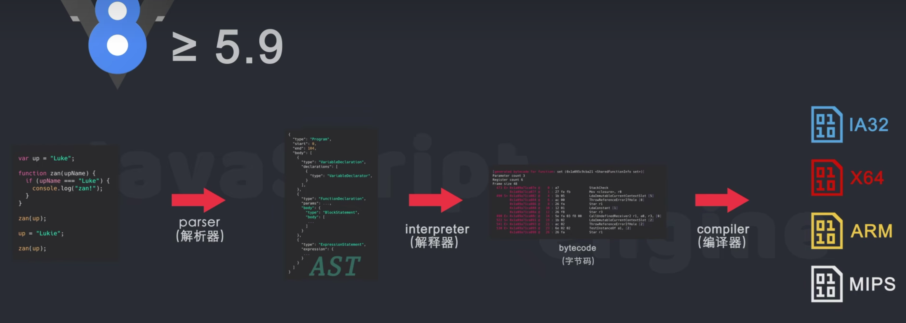

# JS的执行原理
- [B站](https://www.bilibili.com/video/BV1vh411Z7QG)

## JS的发展历史
https://cn.history.js.org/appendices.html#%E6%97%B6%E9%97%B4%E7%BA%BF
#### 计算机是如何运行JS代码的
1. Js是函数式编程和面向对象编程这两种语言风格的混合产物
2. Js引擎: 将JS代码在运行时转化为机器语言
3.  (Chrome的JS引擎是V8)
4. (webkit的js引擎是JavaScriptCore)
5. (火狐的js引擎是SpiderMonkey)
6. (QuickJs)
7. (React Native的引擎是Hermes)
8. 现代的Js引擎都使用了一项技术  ``Just-In-Time Compilation(运行时编译)`` 简称``JIT``
9. 在运行阶段生成机器代码
## JS引擎的执行过程(V8引擎5.9之后的版本)

#### 第一步 将 JS源代码 通过 解析器(parser) 转换成 抽象语法树(AST)
https://segmentfault.com/a/1190000012943992 抽象语法树的基本实现过程
https://esprima.org/demo/parse.html# 抽象语法树可视化工具

```javascript
const esprima = require('esprima');
let code = 'const a = 1';
const ast = esprima.parseScript(code); // 通过esprima生成AST
console.log(typeof ast); // object


const estraverse = require('estraverse'); // 通过estraverse遍历和更新AST
estraverse.traverse(ast, {
    enter: function (node) {
        node.kind = "var";
    }
});

const escodegen = require("escodegen"); // 通过escodegen将AST重新生成源码
const transformCode = escodegen.generate(ast);

console.log(transformCode);


```

#### 第二步 抽象语法树 通过 解释器(interpreter) 转换成 字节码(bytecode)
1. 字节码不是机器代码
2. 字节码与平台无关能够在不同的操作系统上运行
#### 第三步 字节码 通过 编译器(compiler) 转换成 机器代码
1. 编译器会根据当前平台编译出相应的机器代码
2. 这里的机器代码就是汇编代码

## Chrome的V8引擎是如何编译,优化JS代码的?
1. Nodejs的运行时环境也是V8引擎
2. electron的底层引擎也是V8
#### 什么是V8引擎:
1. V8是用C++编写的Google开源高性能JavaScript和WebAssembly引擎.它用于Chrome和Node.js等.
2. 它实现了ECMAScript和WebAssembly,并在Windows 7或更高版本,macOS 10.12+和使用x64,IA-32,ARM或MIPS处理器的Linux系统上运行.
3. 通俗点说就是 一个接受Js代码,编译代码然后执行的C++程序,编译后的代码可以在多种操作系统多种处理器上运行.
#### V8的主要工作
1. 编译和执行JS代码、处理调用栈
2. 内存的分配、垃圾的回收
##### 早期的V8引擎(5.9之前)是如何编译代码的
1. Js由解析器解析后生成Ast抽象语法树
2. Ast 通过 基准编译器(Full-codegen) 生成机器代码 执行
3. 运行一段时间后 由 分析器线程收集了足够的数据后,提供给优化编译器(Crankshaft) 做代码优化,将需要优化的源码 重新解析生成AST
5. CrankShaft使用生成好的AST再生成优化后的机器代码.
#### 5.9之后的V8引擎是如何编译JS代码的?
##### 第一步
1. 源代码 通过 解析器(parser) 生成 抽象语法树(AST)
##### 第二步
1. 抽象语法树 通过 基准解释器(Igniton)  生成 字节码(bytecode)
2. 字节码生成后 删除 抽象语法树,释放内存空间
3. 字节码直接被解释器执行 并作为基准执行模型,
4. 生成的字节码大小相当于等效的基准机器代码的 25%~50%
##### 第三步
1. 在代码的不断的运行过程中,基准解释器收集到了很多可以用来优化的代码信息
2. 这些信息将发送给优化编译器(TruboFan),优化编译器会根据这些信息和字节码来编译出经过优化的机器代码
##### 第四步
1.有可能优化后的机器代码存在问题 则会通过 dexxx 送回给字节码执行

- 视频第8分钟.
#### V8引擎都有哪些优化?
1. 若函数只声明未被调用,不会被解析生成AST,更不会生成字节码
2. 若函数只被调用1次 则基准解释器生成字节码后就直接被解释执行了,优化编译器不会进行优化编译
3. 若函数被``调用多次``则可能会被识别为热点函数,可能会被编译成机器代码,在以后调用时直接执行优化后的机器代码
4. 因为多了一步字节码 且字节码很小 所以网页的加载速度明显变快.
5. 因为在优化时不需要从源码重新编译.这样使性能大幅度提升.为未来js的新功能和优化也铺平了道路
### 调用栈和消息队列
1. 栈: 先进后出
2. 消息队列: 先进先出
3. 调用栈是JS引擎追踪==函数==执行流程的一种机制,当执行环境中调用了多个函数时,通过这种机制,我们能够追踪到哪个函数正在执行,执行的函数体又调用了哪个函数.(递归)
4. 只有调用的函数才会进入调用栈
5. 通过打断点可以在 浏览器的调试器中显示调用栈的具体信息,抛出异常也可以在浏览器的控制台中显示调用栈信息
6. 递归是最容易出现堆栈溢出的情况(Maximum call stack size exceeded)
7. 因为js是单线程所有JS环境只有一个调用栈


#### 扩展阅读
浏览器是如何工作的: Chrome V8 让你更懂 https://mp.weixin.qq.com/s/0OxNG1AWrkTIVK6N36wk4A
