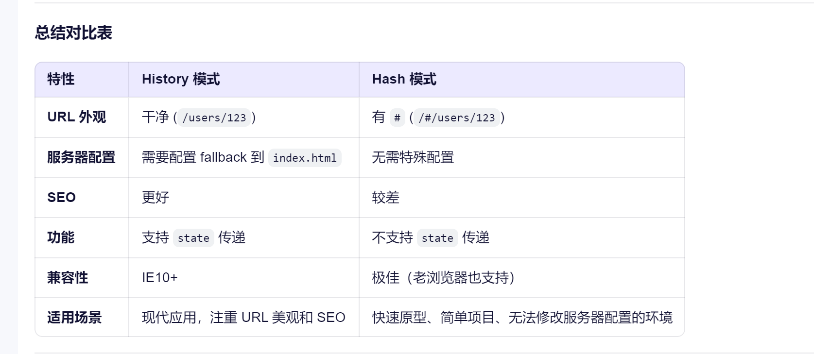

# History 和 Hash的区别
- 表面区别: 路由的路径来源不同.
    1. 路径的来源: `memoryRouter`(移动端开发), `historyRouter`, `hashRouter';
- 实现上的区别: 见下文.

## History
- 没有任何一个事件能监听 url上的 `path` 的变化.
#### 原生History对应的方法
```javascript
history.back(); // 后退
history.forward(); // 等于前进
history.go(1); // 前进 = history.forward()
history.go(-1);// 后退 = history.back()
history.go(0); // 刷新当前页面
history.pushState(state, title, url); // 添加历史记录
history.replaceState(state, title, url); // 替换当前历史记录
```

#### ReactRouter中的 ``history`` - 通义千问
- 利用了 HTML5 History API `history.pushState` 和 `history.replaceState` 方法来实现。
- React Router 并不直接使用原生的 window.history。它使用了一个叫做 history 的库（由 React Router 团队维护）来创建一个更高级的、可编程的 history 对象。
- 这个 history 对象提供了：
  - `push(path, state)`: 内部调用 `pushState`。
  - `replace(path, state)`: 内部调用 `replaceState`。
  - `listen(listener)`: 监听所有路由变化（包括 `push`、`replace` 和 `popstate`）。
  - `location`: 当前的 `location` 对象。
##### 具体过程
- 拦截用户导航（点击链接、前进/后退按钮）。
- 使用 history.pushState() 或 history.replaceState() 来修改 URL 而``不刷新``页面。
- 监听浏览器的 `popstate` 事件来捕获前进/后退操作。
- 根据新的 URL 更新 React 组件，实现视图切换。

```javascript
// 伪代码：React Router 监听 popstate
window.addEventListener('popstate', (event) => {
  // 获取当前 URL 的路径
  const newLocation = window.location.pathname;

  // 通知 React Router 路由已改变
  // 它会根据 newLocation 匹配路由并重新渲染
  handleLocationChange(newLocation);
});
```
##### 关键点
- 无刷新
- 依赖 HTML5 History API
- 服务器配置

## Hash
#### 前端开发中的路由,其实就是操作url地址
1.  改变浏览器地址
2.  内容区切换内容

#### hash的特点
1.  改变url的时候, 不会刷新页面
2.  当 一个窗口的 hash （URL 中 # 后面的部分）改变时就会触发 `hashchange` 事件（参见 location.hash）。
3.  监听事件, `hashchange` 用它来监听url路径变化

##### 代码

1.  事件委托
2.  window\.location.hash改变
3.  hashchange事件监听
4.  改变页面内容

```html
<!DOCTYPE html>
<html lang='en'>
<head>
  <meta charset='UTF-8'>
  <title>Title</title>
  <style>
    a,#divId{
      font-size: 33px;
    }

  </style>
</head>
<body>
  <ul id='shijianweituo'>
    <li>
      <a data-url='/aa'>
        aaaa
      </a>
    </li>
    <li>
      <a data-url='/bb'>
        bbbbb
      </a>
    </li>
    <li>
      <a data-url='/cc'>
        ccccc
      </a>
    </li>
  </ul>
  <div id='divId'>默认内容</div>
<script>
   var _path = '';
   const pathData = [
     {
       path: '/aa',
       pathData: 'aaaaa页',
     },
     {
       path: '/bb',
       pathData: 'bbbbbb页',
     },
     {
       path: '/cc',
       pathData: 'ccccc页',
     },
   ];
   let _aBtn = document.getElementsByTagName('a');
   let _divId = document.getElementById('divId');

   // 事件委托
   document.getElementById('shijianweituo').addEventListener('click', function(e){
     // 使用事件委托监听 li的监听事件
     // 这样改下就只有点击li会触发事件了，且每次只执行一次dom操作，如果li数量很多的话，将大大减少dom的操作，优化的性能可想而知！
     // https://www.cnblogs.com/lauzhishuai/p/11263210.html
     _path = e.target.dataset.url; // 获取新路由
     window.location.hash = _path; // 改变浏览器的# 号后的参数值
   });

   window.addEventListener('hashchange', function(){
       // 监听hashchange事件
     pathData.find((y) => {
       if(y.path === _path){
         _divId.innerHTML = y.pathData;
         return true;
       }else{
         return false;
       }
     })
   });

</script>
</body>
</html>


```
## Hash和History的对比

